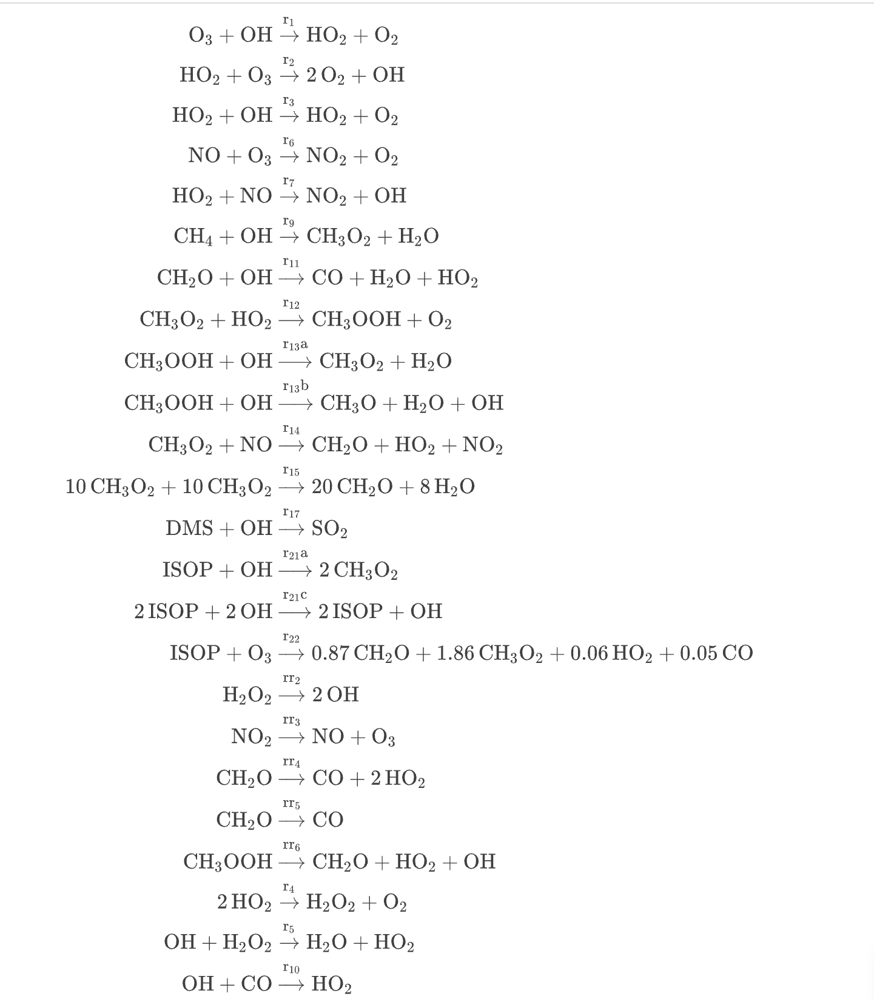

```@meta
CurrentModule = GasChem
```

# GasChem: Gas-Phase Atmospheric Chemical Mechanisms

This atmospheric chemical system model [GasChem](https://github.com/EarthSciML/GasChem.jl) is built based on the Super Fast Chemical Mechanism, which is one of the simplest representations of atmospheric chemistry. It can efficiently simulate background tropheric ozone chemistry and perform well for those species included in the mechanism. The chemical equations used is included in the supporting table S2 of the paper,
["Evaluating simplified chemical mechanisms within present-day simulations of the Community Earth System Model version 1.2 with CAM4 (CESM1.2 CAM-chem):
MOZART-4 vs. Reduced Hydrocarbon vs. Super-Fast chemistry" (2018), Benjamin Brown-Steiner, Noelle E. Selin, Ronald G. Prinn, Simone Tilmes, Louisa Emmons, Jean-François Lamarque, and Philip Cameron-Smith.](https://gmd.copernicus.org/articles/11/4155/2018/)


## Illustrative Example
Here is a simple example of generating and solving the superfast model. 
```julia @example 1
using GasChem, EarthSciMLBase, ModelingToolkit, Unitful, DifferentialEquations

@parameters t [unit = u"s", description = "Time"]
model = SuperFast(t)
```

Before running any simulations with the model, we need to convert it into a system of differential equations. We can solve it using the default values for variables and parameters. However, by using the ```@unpack``` command, we can assign new values to specific variables and parameters, allowing for simulations under varied conditions.

```julia @example 1
sys = structural_simplify(get_mtk(model))
@unpack O3 = sys
tspan = (0.0, 3600*24)
u0 = [O3 => 15] # Change the initial concentration of O₃ to 15 ppb
p0 = [T => 293] # temperature = 293K
prob = ODEProblem(sys, u0, tspan, p0)
```
The reaction equations in the system are: 


We can visualize the mathematical relationships within the system as follows:
```@example 1
using Latexify
render(latexify(equations(sys)))
```
We can finally solve the system and plot the result as

```@example 1
sol = solve(prob,AutoTsit5(Rosenbrock23()), saveat=10.0)

using Plots
plot(sol, ylim = (0,50), xlabel = "Time", ylabel = "Concentration (ppb)", legend=:outerright)
```

## Variables and parameters
The species included in the superfast model are: O<sub>3</sub>, OH, HO<sub>2</sub>, O<sub>2</sub>, NO, NO<sub>2</sub>, CH<sub>4</sub>, CH<sub>3</sub>O2, H<sub>2</sub>O, CH<sub>2</sub>O, CO, CH<sub>3</sub>OOH, CH<sub>3</sub>O, DMS, SO<sub>2</sub>, ISOP, O<sub>1</sub>d, H<sub>2</sub>O<sub>2</sub>.

The parameters in the model that are not constant are the photolysis reaction rates ```jO31D```, ```j2OH```, ```jH2O2```, ```jNO2```, ```jCH2Oa```, ```jCH3OOH``` and temperature ```T```
```@example 1
states(sys) # Give you the variables in the system
parameters(sys) # Give you the parameters in the system
```

Let's run some simulation with different values for parameter ```T```.
```julia @example 1
p1 = [T => 273]
p2 = [T => 298]
sol1 = solve(ODEProblem(sys, [], tspan, p1),AutoTsit5(Rosenbrock23()), saveat=10.0)
sol2 = solve(ODEProblem(sys, [], tspan, p2),AutoTsit5(Rosenbrock23()), saveat=10.0)

plot([sol1[O3],sol2[O3]], label = ["T=273K" "T=298K"], title = "Change of O3 concentration at different temperatures", xlabel="Time (second)", ylabel="concentration (ppb)")
```
