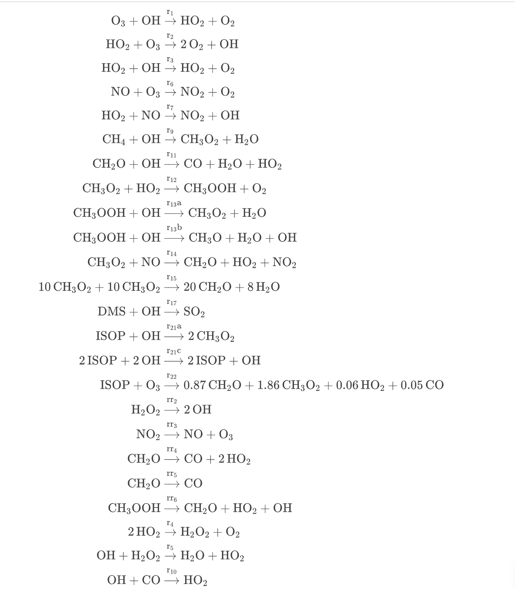

```@meta
CurrentModule = GasChemMTK
```

# GasChemMTK

This atmospheric chemical system model [GasChemMTK](https://github.com/EarthSciML/GasChemMTK.jl) is built based on the Super Fast Chemical Mechanism, which is one of the simplest representations of atmospheric chemistry. It can efficiently simulate background tropheric ozone chemistry and perform well for those species included in the mechanism. The chemical equations used is included in the supporting table S2 of the paper,
"Evaluating simplified chemical mechanisms within present-day simulations of the Community Earth System Model version 1.2 with CAM4 (CESM1.2 CAM-chem):
MOZART-4 vs. Reduced Hydrocarbon vs. Super-Fast chemistry" (2018), Benjamin Brown-Steiner, Noelle E. Selin, Ronald G. Prinn, Simone Tilmes, Louisa Emmons, Jean-François Lamarque, and Philip Cameron-Smith.


## Illustrative Example
Here is a simple example of generating, visualizing and solving the superfast
model. We first define all parameters and variables.
```julia
begin
	@parameters r1 [unit = u"ppb/s"]
	@parameters r2 [unit = u"ppb/s"]
	@parameters r3 [unit = u"ppb/s"]
	@parameters r6 [unit = u"ppb/s"]
	@parameters r7 [unit = u"ppb/s"]
	@parameters r9 [unit = u"ppb/s"]
	@parameters r11 [unit = u"ppb/s"]
	@parameters r12 [unit = u"ppb/s"]
	@parameters r13a [unit = u"ppb/s"]
	@parameters r13b [unit = u"ppb/s"]
	@parameters r14 [unit = u"ppb/s"]
	@parameters r15 [unit = u"ppb/s"]
	@parameters r17 [unit = u"ppb/s"]
	@parameters r21a [unit = u"ppb/s"]
	@parameters r21c [unit = u"ppb/s"]
	@parameters r22 [unit = u"ppb/s"]
	@parameters rr1 [unit = u"ppb/s"]
	@parameters rr2 [unit = u"ppb/s"]
	@parameters rr3 [unit = u"ppb/s"]
	@parameters rr4 [unit = u"ppb/s"]
	@parameters rr5 [unit = u"ppb/s"]
	@parameters rr6  [unit = u"ppb/s"]
	@parameters r4 [unit = u"ppb/s"]
	@parameters r5 [unit = u"ppb/s"]
	@parameters r10 [unit = u"ppb/s"]
	@parameters t [unit = u"s"]
	@variables O3(t) [unit = u"ppb"]
	@variables OH(t) [unit = u"ppb"]
	@variables HO2(t) [unit = u"ppb"]
	@variables O2(t) [unit = u"ppb"]
	@variables H2O(t) [unit = u"ppb"]
	@variables NO(t) [unit = u"ppb"]
	@variables NO2(t) [unit = u"ppb"]
	@variables CH4(t) [unit = u"ppb"]
	@variables CH3O2(t) [unit = u"ppb"]
	@variables CH2O(t) [unit = u"ppb"]
	@variables CO(t) [unit = u"ppb"]
	@variables CH3OOH(t) [unit = u"ppb"]
	@variables CH3O(t) [unit = u"ppb"]
	@variables DMS(t) [unit = u"ppb"]
	@variables SO2(t) [unit = u"ppb"]
	@variables ISOP(t) [unit = u"ppb"]
	@variables H2O2(t) [unit = u"ppb"]
end
```
Then we define the chemical reaction model.
```julia
rxs = [Reaction(r1, [O3,OH], [HO2,O2], [1,1], [1,1]) #O3 + OH --> HO2 + O2
       Reaction(r2, [HO2,O3], [O2,OH],[1,1],[2,1])#HO2 + O3 --> 2O2 + OH
	   Reaction(r3, [HO2,OH], [HO2,O2],[1,1],[1,1]) #HO2 + OH --> H2O + O2
	   Reaction(r6, [NO,O3], [NO2,O2],[1,1],[1,1]) #NO + O3 --> NO2 + O2
	   Reaction(r7, [HO2,NO], [NO2,OH],[1,1],[1,1]) #HO2 + NO --> NO2 + OH
	   Reaction(r9, [CH4, OH], [CH3O2, H2O],[1,1],[1,1]) #CH4 + OH --> CH3O2 + H2O
	   Reaction(r11, [CH2O,OH], [CO,H2O,HO2],[1,1],[1,1,1]) 
	   #CH2O + OH --> CO + H2O + HO2
	   Reaction(r12, [CH3O2,HO2], [CH3OOH,O2],[1,1],[1,1]) 
	   #CH3O2 + HO2 --> CH3OOH + O2
	   Reaction(r13a, [CH3OOH,OH], [CH3O2,H2O],[1,1],[1,1]) 
	   #CH3OOH + OH --> CH3O2 + H2O
	   Reaction(r13b, [CH3OOH,OH], [CH3O,H2O,OH],[1,1],[1,1,1]) 
	   #CH3OOH + OH --> CH3O + H2O + OH
	   Reaction(r14, [CH3O2,NO], [CH2O,HO2,NO2],[1,1],[1,1,1])
	   #CH3O2 + NO --> CH2O + HO2 + NO2
	   Reaction(r15, [CH3O2,CH3O2], [CH2O,H2O],[10,10],[20,8])
	   #10CH3O2 + 10CH3O2 --> 20CH2O + 8HO2
	   Reaction(r17, [DMS,OH], [SO2],[1,1],[1]) 
	   #DMS + OH --> SO2
	   Reaction(r21a, [ISOP,OH], [CH3O2],[1,1],[2])
	   #ISOP +OH --> 2CH3O2
	   Reaction(r21c, [ISOP,OH], [ISOP,OH],[2,2],[2,1])
	   #2ISOP + 2OH --> 2ISOP + OH
	   Reaction(r22, [ISOP,O3], [CH2O,CH3O2,HO2,CO], [1,1.0], [0.87,1.86,0.06,0.05])
	   #ISOP + O3 --> 0.87CH2O + 1.86CH3O2 + 0.06HO2 + 0.05CO
	   Reaction(rr2, [H2O2], [OH], [1], [2])
	   #H2O2 --> 2OH
	   Reaction(rr3, [NO2], [NO,O3], [1], [1,1])
	   #NO2 --> NO + O3
	   Reaction(rr4, [CH2O], [CO,HO2], [1], [1,2])
	   #CH2O --> CO + 2HO2
	   Reaction(rr5, [CH2O], [CO], [1], [1])
	   #CH2O --> CO
	   Reaction(rr6, [CH3OOH], [CH2O,HO2,OH], [1], [1,1,1])
	   #CH3OOH --> CH2O + HO2 + OH
	   Reaction(r4, [HO2],[H2O2,O2],[2],[1,1])
	   #HO2 + HO2 = H2O2 + O2
	   Reaction(r5,[OH,H2O2],[H2O,HO2],[1,1],[1,1])
	   #OH + H2O2 = H2O + HO2
	   Reaction(r10,[OH,CO],[HO2],[1,1],[1])
	   #OH + CO = HO2
	   ] 
```

```julia
@named rs = ReactionSystem(rxs, t)
```
which in Jupyter notebooks will give the figure that represents the reation networks.



